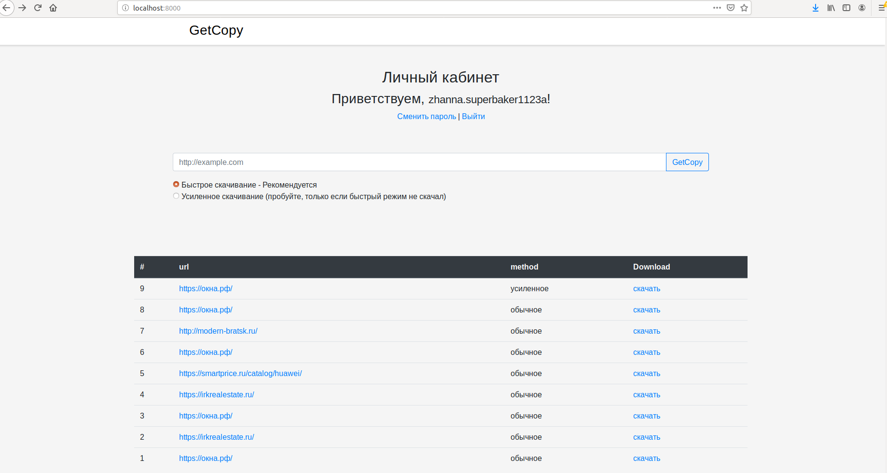
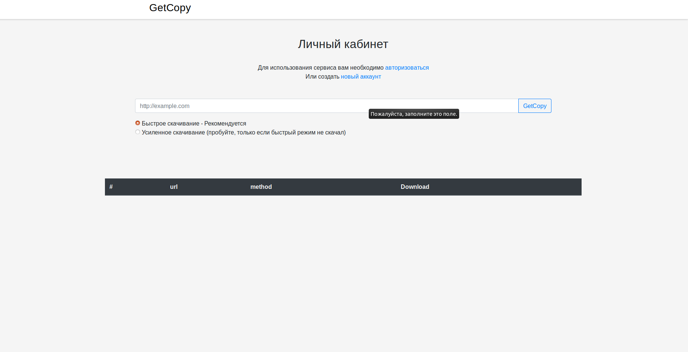
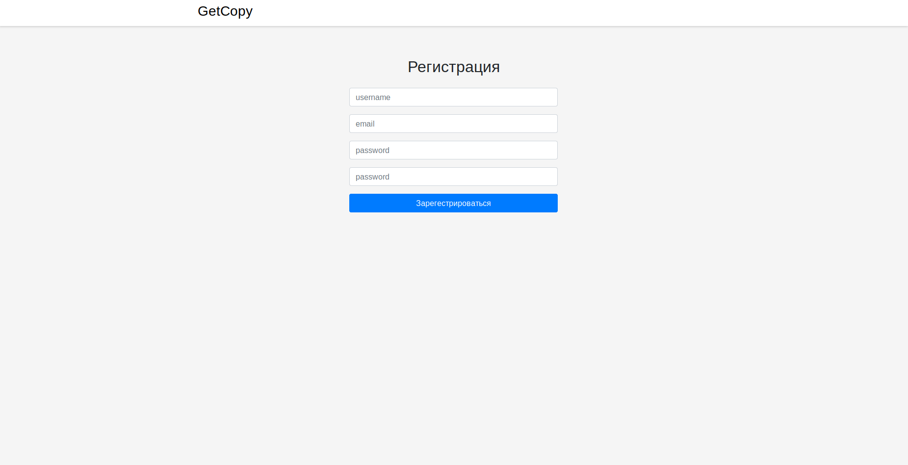
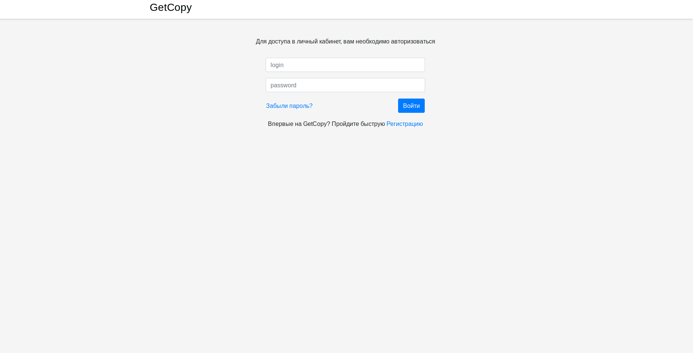
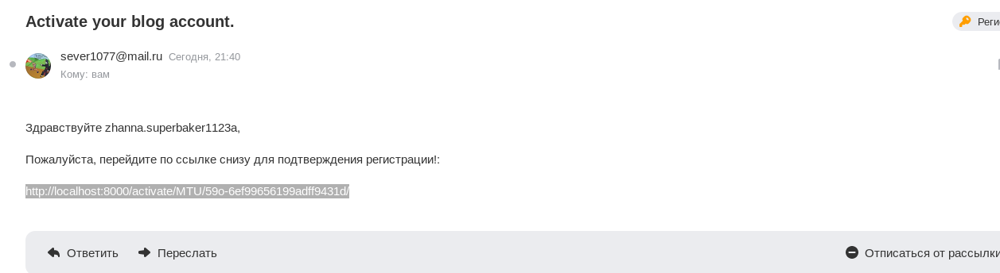

# GetCopy

Сервис предназначен для копирования сайтов одностраничков, лендингов.
Выкачивает все изображения/стили/скрипты и складывает в zip архив для скачивания.

## Режимы работы

Есть 2 варианта скачивания, простое и усиленное. 
Простое - все файлы будут взять из кода, который отдается при отправке GET запроса на url.
Усиленное предназначенно для сайтов использующих ajax, для этого применяется selenium (гекодрайвер в комплект не входит).

## Интерфейс личного кабинета пользователя

## Интерфейс личного кабинета анонима

## Регистрация/вход/подтверждение по почте

